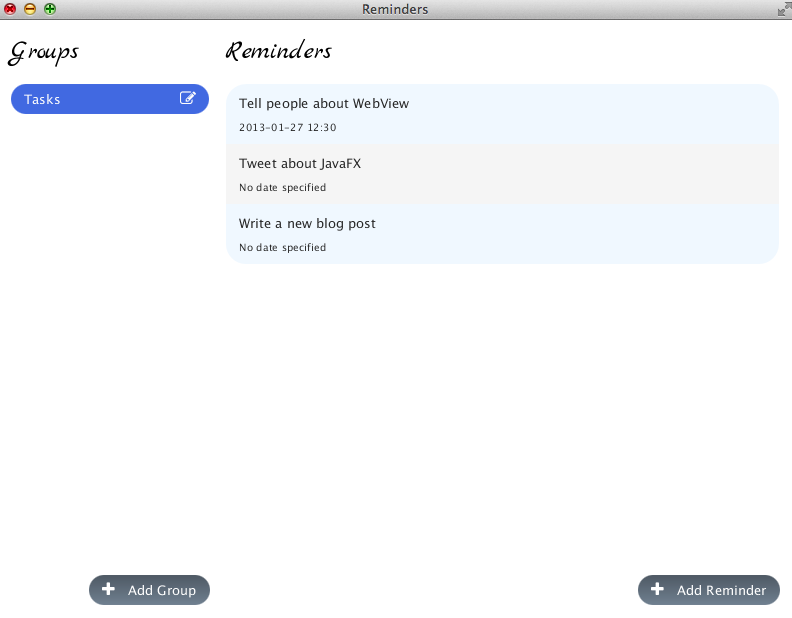
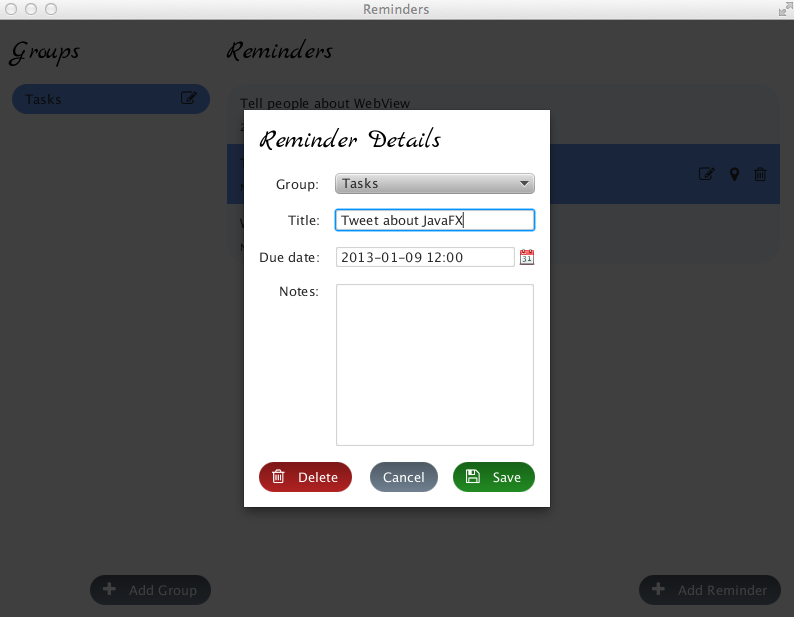
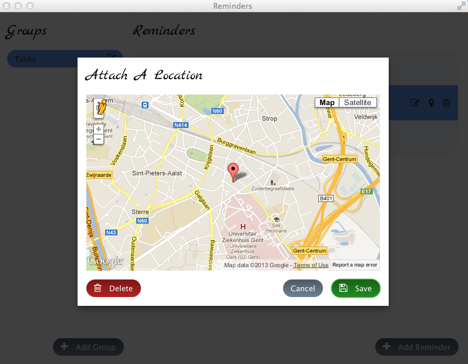
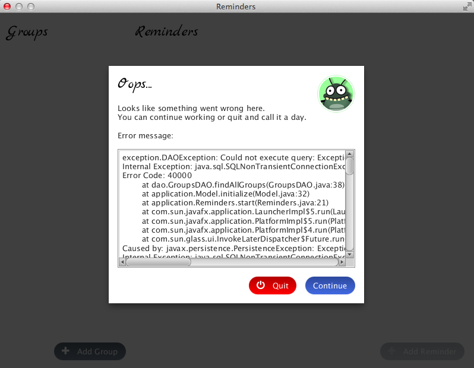

# Reminders

Reminders was my attempt at a serious yet fun JavaFX application.
It was really popular when it was released due to its many cool features:

- JPA is used for persistence, together with bean validation to check constraints before persisting an entity.
- <a href="https://fortawesome.github.io/Font-Awesome/">FontAwesome</a> is used for its cool icons. They look great and because they are text, you can easily change their size or color.
- CSS is used to completely change the look and feel of ListView and Button nodes.
- It has neat dialog windows. The code for these should be pretty reusable.
- It includes a location picker written in JavaScript, but seamlessly incorporated into JavaFX thanks to the WebView.
- It uses <a href="http://jfxtras.org">JFxtras</a> for its CalendarTextField which, truth be told, works great but looks hella-ugly.

## Screenshots

## Setup

First you'll need a database to run this application. There are two ways to get one:

1. In NetBeans, go to the `Services` window. Under `Databases`, right-click `Java DB` and create a new database with the following settings:
    - Name: `Reminders`
    - Username: `APP`
    - Password: `APP`
2. Create your own empty database and edit `persistence.xml` to use this database. Make sure you add the correct JDBC driver to the project.

You should now be able to run the application. The database schema will be created upon first use. Once this is done, you can edit `persistence.xml` to set the table generation strategy to `none`.

The required libraries are found in the `lib` folder. You will also need EclipseLink and the Java DB Driver (if you chose option 1), but NetBeans already has those bundled with it. 

This repository contains a NetBeans project. It was last tested using NetBeans 8.0.2 and JDK 8u25. It was originally developed using JDK 7 and JavaFX 2 in early 2013.
